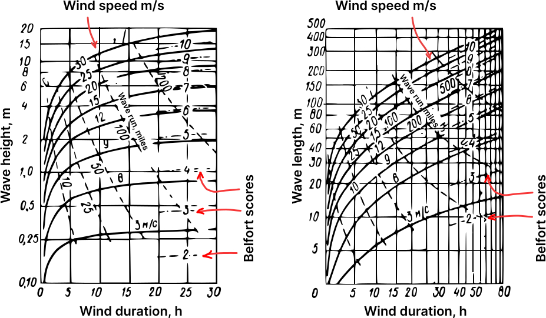

# Graphene

## Deep and Shallow Sea
The terms "deep" and "shallow" refer to the relationship between water depth and wavelength, and the use of these terms allows scientists to describe the characteristics of wave propagation in various marine conditions. For example, in the theory of deep-water waves (in deep sea), equations can be simplified by ignoring the influence of the bottom. In shallow seas, on the other hand, the influence of the bottom and changes in depth become important.

### Deep Sea:
A sea is considered deep if its depth is significantly greater than the wavelength. In deep sea, waves usually exhibit properties characteristic of deep-water waves. These waves do not feel the bottom, and their speed depends only on their length.

### Shallow Sea:
Conversely, a sea is considered shallow if its depth is comparable to the wavelength. In shallow sea, waves interact with the bottom, and their properties depend not only on the wavelength but also on the water depth. In this case, the formation of various types of waves, such as coastal waves, is possible.

# Wave power

